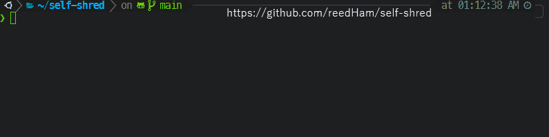

# self-shred



This bash script deletes itself using unix [Shred](https://en.wikipedia.org/wiki/Shred_(Unix)) the after successfully running.  
Add the code in `self-shred.bash` to the end of your bash script to delete after execution.  
This can be used to increase security by removing scripts with passwords or other sensitive information automatically.  

If you just want to add self shredding to your bash scripts, you can do so by adding the following line:

```bash
shred -u "${0}"
```

where `${0}` is a magic variable automagically set to path to the script.

Idea from https://stackoverflow.com/a/3430367